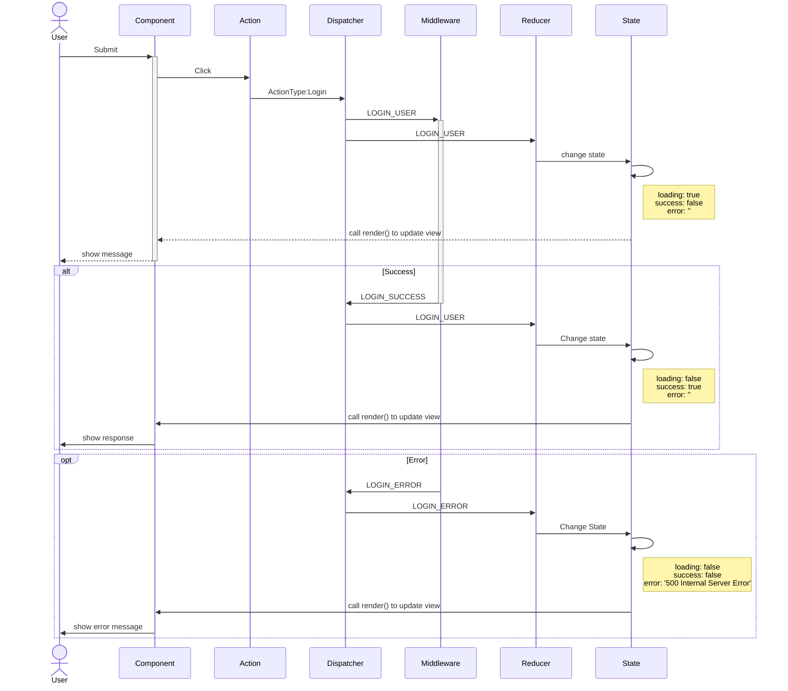

```mermaid
sequenceDiagram
    Actor User
    participant Component
    participant Action
    participant Dispatcher
    participant Middleware
    participant Reducer
    participant State

    User->>+Component: Submit
    Component->>Action: Click
    Action->>Dispatcher: ActionType:Login
    Dispatcher->>+Middleware: LOGIN_USER
    Dispatcher->>Reducer: LOGIN_USER
    Reducer->>State: change state
    State->>State: 　
    Note right of State: loading: true<br/>success: false<br/>error: ''
    State-->>Component: call render() to update view
    Component-->>-User: show message
    alt Success
    Middleware->>-Dispatcher: LOGIN_SUCCESS
    Dispatcher->>Reducer: LOGIN_USER
    Reducer->>State: Change state
    State->>State: 　
    Note right of State: loading: false<br/>success: true<br/>error: ''
    State->>Component: call render() to update view
    Component->>User: show response
    end
    opt Error
    Middleware->>Dispatcher: LOGIN_ERROR
    Dispatcher->>Reducer: LOGIN_ERROR
    Reducer->>State: Change State
    State->>State:　
    Note right of State: loading: false<br/>success: false<br/>error: '500 Internal Server Error'
    State->>Component: call render() to update view
    Component->>User: show error message
    end
```
