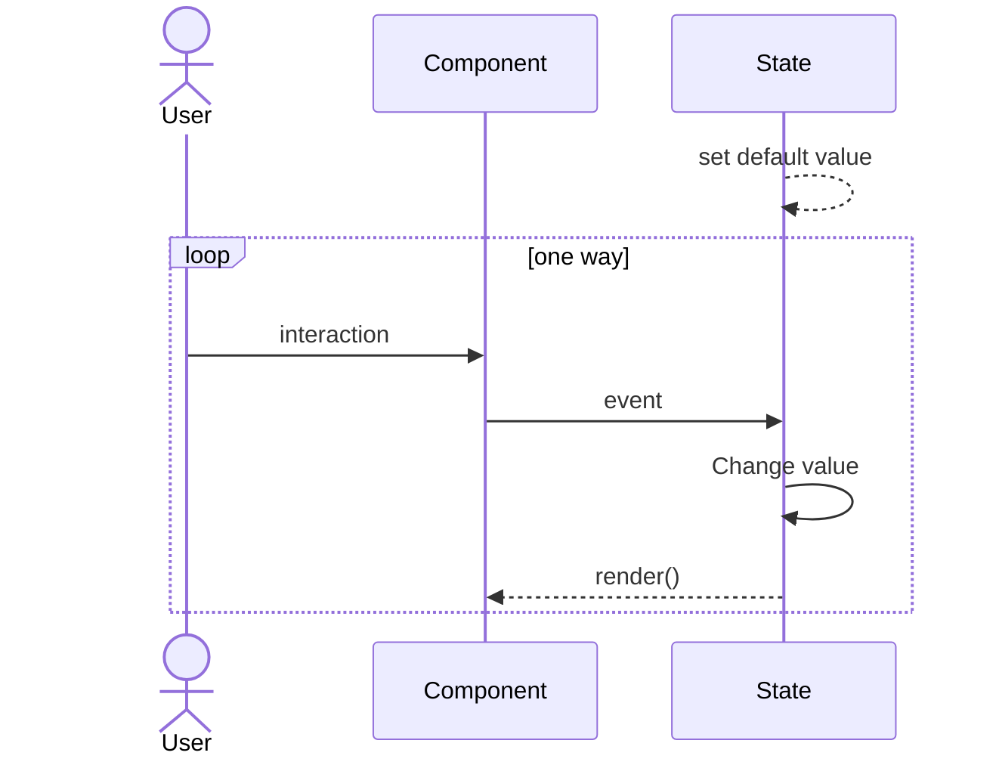
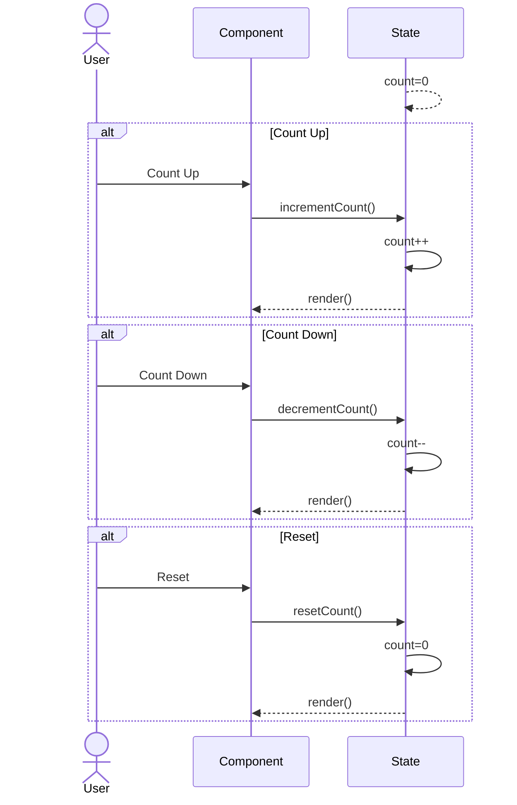

```mermaid
sequenceDiagram
    Actor User
    participant Component
    participant State
    State-->>State: set default value
    loop one way
    User->>Component: interaction
    Component->>State: event
    State->>State: Change value
    State-->>Component: render();
    end
```

## Example Counter

```mermaid
sequenceDiagram
    Actor User
    participant Component
    participant State

    State-->>State: count=0

    alt Count Up
        User->>Component: Count Up
        Component->>State: incrementCount()
        State->>State: count++
        State-->>Component: render();
    end

    alt Count Down
        User->>Component: Count Down
        Component->>State: decrementCount()
        State->>State: count--
        State-->>Component: render();
    end


    alt Reset
        User->>Component: Reset
        Component->>State: resetCount()
        State->>State: count=0
        State-->>Component: render();
    end

```
